```mermaid
graph TD
    A[New Request] --> B{Token Available?}
    B -- Yes --> C[Consume One Token]
    C --> D[✅ Request Allowed]
    B -- No --> E[Refill Tokens]
    E --> F{New Token Available?}
    F -- Yes --> C
    F -- No --> G[❌ Rate Limit Applied]
    G --> H[Execute Rate Limit Callback]
```

# Closure-Based Rate Limiter 🚦

This project implements a rate limiter in Go using **closures**.
The goal is to demonstrate how closures can be used to maintain internal state
without relying on global variables.

---

## 📌 Problem Description

The task is to create a rate limiter that:
- Limits the number of allowed requests
- Refills capacity over time
- Uses closures to keep internal state

---

## 🧠 Solution Overview

This implementation is based on the **Token Bucket** algorithm:
- A fixed number of tokens is available
- Tokens are refilled over time
- Each request consumes one token
- When no tokens are left, requests are denied

The rate limiter is created by a function that returns another function.
This returned function is the closure.

---

---
## 🔒 How Closures Are Used

The `NewRateLimiter` function returns a function with access to internal variables:

- current token count
- refill rate
- last refill time

These variables are captured by the closure and preserved between calls,
allowing the rate limiter to maintain state safely and cleanly.

---

## ▶️ How to Run

```bash
go run main.go
```


